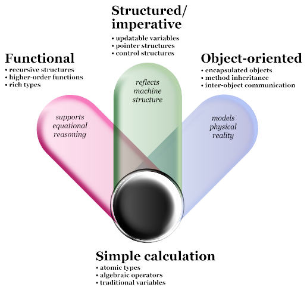
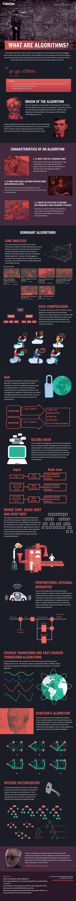

# Lunes 11 de Febrero de 2019

# Paradigmas de programación y Algoritmos

Hoy veremos como la forma de pensar al resolver problemas en la computadora (**paradigma de programación**) afecta la manera en la que organizamos y expresamos las órdenes que damos (**algoritmo**).

- Abordamos los conceptos de:
	1. Paradigma de programación
	2. Programación procedural/estructurada
  	3. Programación orientada a objetos
  	4. Programación funcional
  	5. Algoritmo
  
  
## Paradigmas de programación

### Programación Estructurada/ Imperativa

Básicamente:
- Actualizamos variables (actualizamos valores),
- Referimos a punteros (decimos "el valor de la variable **x** está en la dirección **y**"),
- Añadimos estructuras de control (if, else, for, while, etc)

### Programación Orientada a Objetos (POOO)

Ya vimos esto en la clase del 07/02/2019

### Programación Funcional
Básicamente:
- Aceptamos y optimizamos el uso de estructuras recursivas
- Usamos funciones de orden superior (funciones que aceptan funciones/devuelven funciones)
- Seguimos usando variedad de tipos (como en POO)

## Algoritmos

La solución de cualquier problema computacional involucra la ejecución de una *serie de acciones en un orden específico*. Un **procedimiento** para resolver un problema en términos de
1. las **acciones** a ser ejecutadas, y
2. el **orden** en el que estas acciones son ejecutadas
se llama **algoritmo**. 

A la especificación del orden en el que las declaraciones serán ejecutadas en la computadora se llama **control del programa** o **control de flujo**.

