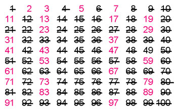
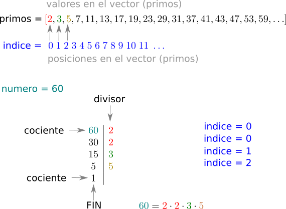

# Jueves 21 de Febrero de 2019

En la clase de hoy fortaleceremos nuestras habilidades programando funciones que hagan uso de **ciclos**, **sentencias condicionales**, **operadores** y **control de flujo**. 

## Actividad 1. Factorización prima

Nuestra primera misión del día será escribir un programa que, dado un número entero, encuentre e imprima sus factores primos. Un ejemplo del funcionamiento deseado se muestra a continuación:

```shell
Inserte un entero: 18
Su entero es: 18
18 es divisible entre 2 ? => SI
9 es divisible entre 2 ? => NO
9 es divisible entre 3 ? => SI
3 es divisible entre 3 ? => SI
Los factores primos del número 18 son: 
2
3
3
```

Una lista no completa de números primos es
```shell
2,3,5,7,11,13,17,19,23,29,31,37,41,43,47,53,59,61,67,71,73,79,83,89,97,101,...
```



Para recordar como se encuentra una factorización prima en forma manual, presentamos un ejemplo:



## Actividad 2. Operaciones básicas con vectores

Para aplicar la factorización prima que recién terminamos, necesitamos aprender un mínimo básico sobre el uso de vectores, particularmente vectores de enteros. Especificamente nos interesamos en implementar tres funciones con la siguientes características

1. **Pertenecia**: determine si un entero se encuentra en un vector de enteros
```cpp
vector<int> miVector = {1,2,3,5,6}				// Inicialización de un vector con valores
int miNumero;
bool encontrado = false;

miNumero = 2;
encontrado = encuentraEnVector(miNumero, miVector);	// Devuelve 'true'

miNumero = 4;
encontrado = encuentraEnVector(miNumero, miVector);	// Devuelve 'false'
```

2. **Conteo de ocurrencias**: halle el número de veces que un entero aparece en un vector de enteros

```cpp
vector<int> miVector = {1,2,3,5,3,6}		// Inicialización de un vector con valores
int miNumero;
int conteo = 0;

miNumero = 2;
conteo = cuentaEnVector(miNumero, miVector);		// Devuelve 1

miNumero = 3;
conteo = cuentaEnVector(miNumero, miVector);		// Devuelve 2

miNumero = 4;
conteo = cuentaEnVector(miNumero, miVector);		// Devuelve 0
```

3. **Elementos únicos**: halle a todos los enteros diferentes en un vector de enteros


```cpp
vector<int> miVector = {1,2,3,5,3,6}			// Inicialización de un vector con valores
vector<int> unicos;

unicos = unicosEnVector(miNumero, miVector);		// Devuelve [1,2,3,5,6]
```

4. **Unión**: dados dos vectores A y B, cree un nuevo vector que contenga todos los elementos de A y B, sin repetir (todos los elementos son únicos).


Para la implementación de las cuatro funciones anteriores le es leer y entender los siguientes usos
```cpp
void imprimeVectorInt(vector<int> vec){
  for (int i = 0; i < vec.size(); i++) 
  {
    cout << vec[i] << endl;
  }
}

vector<int> A = {5,3,2}			// Inicialización de un vector con valores
imprimeVectorInt(A);
/*
5
3
2
*/
cout << A[0] << endl; 				// Imprime elemento en la posición 0 del vecto A
/*
5
*/
cout << A.size() << endl; 			// Imprime la longitud del vector A
/*
3
*/
A.push_back(4);					// Añade un 4 a la derecha del vector A
imprimeVectorInt(A);
/*
5
3
2
4
*/
```


#  Trabajo 1.2
  1. Implemente las funciones descritas en las secciones **Actividad 1** y **Actividad 2**. Algunas las habrá terminado en la clase de **hoy**, las otras deberá completarlas fuera del salón.
  2. No olvide consultar la [referencia](../clase-18-02-2019/clase-18-02-2019.md) o enviar un mensaje al grupo en caso de dudas.
  3. 
  
  
 El formato del trabajo es proyecto de Visual Studio. Debera ser enviado al correo del profesor, a más tardar el día Lunes 25 de Febrero de 2019, antes de terminar la clase.


